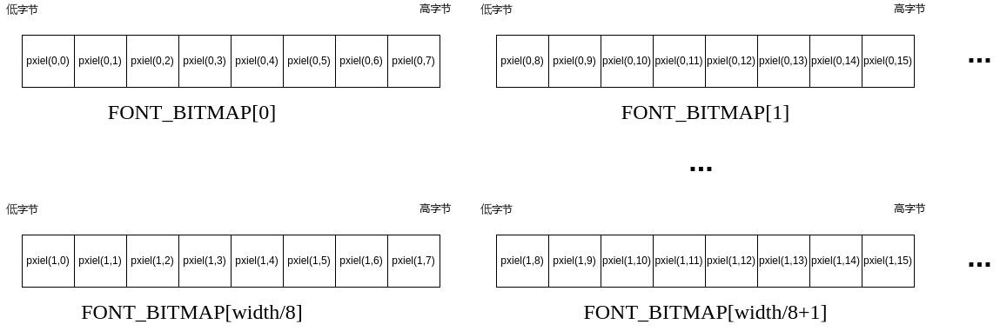

# arduino-chinese-font
## 字库使用
### 依赖
- `ChineseFontBitMap.h`     ——头文件
- `SimpleMap.h`             ——map头文件
- `ChineseFontBitMap.cpp`   ——map实现
- `font_bitmap.h`           ——字库文件  
### 使用示例
使用[ST7302SPI](https://github.com/zhcong/ST7302-for-arduino)驱动屏幕作为展示, 合宙esp32 c3开发板作为MCU
```c++
#include <ST7302SPI.h>
#include "ChineseFontBitMap.h"

#define _PIN_RST_ 1
#define _PIN_DC_ 0
#define _PIN_CS_ 7
#define _PIN_SCK_ 2
#define _PIN_MOSI_ 3
#define _PIN_MISO_ -1

# define BYTE_SIZE 8

ST7302SPI st7302spi(_PIN_SCK_, _PIN_MISO_, _PIN_MOSI_, _PIN_RST_, _PIN_DC_, _PIN_CS_, 250, 122);
ChineseFontBitMap chineseFontBitMap;

// 将utf-8的字符数组展示在屏幕
void print_chinese(int x_byte_start, int y_start,  String str[], int len) {
  for (int i = 0; i != len; i++) {
    st7302spi.set_memory(x_byte_start + i * int(chineseFontBitMap.get_pixel_len() / BYTE_SIZE), y_start, chineseFontBitMap.get_pixel_len(), chineseFontBitMap.get_pixel_len(), chineseFontBitMap.get_map(str[i]), chineseFontBitMap.get_byte_len());
  }
}

void setup() {
  Serial.begin(115200);
  // led set
  pinMode(13, OUTPUT);
  pinMode(12, OUTPUT);
  digitalWrite(12, LOW);
  digitalWrite(13, HIGH);
  st7302spi.begin();
//  st7302spi.inversion_on();
  String str[]={"你","好","B","站"};
  print_chinese(10, 10, str, 4);
  st7302spi.flush_buffer();
}

void loop() {
  // delay(2000);
}

```

## 像素与byte
映射关系如下

## 生成自定义字库
见[子功能](make_font/README.MD)
## 其他
micropython版本：[https://github.com/zhcong/micropython-chinese-font](https://github.com/zhcong/micropython-chinese-font)
## 感谢
[SimpleMap](https://github.com/spacehuhn/SimpleMap)